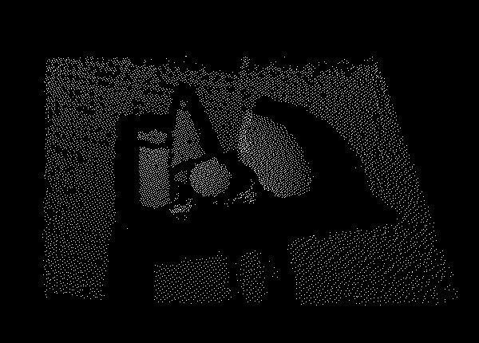

# FindSurface-Samples / SimpleGUI / Readme.md
**Curv*Surf* FindSurface™ SDK** Samples - SimpleGUI


Overview
--------

This sample code provides an example of GUI application, which it benefits users to interact and manipulate the application.  

The sample code is for Windows and Linux environments.  

The sample program will allow users to obtain the following data:  

once a user clicks a surface on a rendered point cloud, then the program detects **the parametric model** of the surface.

**The sample program only runs with our FindSurface SDK library files (FindSurface.dll, etc.).**

**You must either [request a free trial](http://developers.curvsurf.com/licenses.jsp) or [purchase a license](https://developers.curvsurf.com/licenses.jsp) to activate the library files.**


Requirements
------------

### Windows

This sample requires GLEW library.

You can download GLEW binaries at [glew.sourceforge.net/](http://glew.sourceforge.net/).

### Linux

This sample requires OpenGL library.

Install the GCC C compilers and associated tools such as _make_ if they have not been installed.

```bash
sudo apt-get install build-essential libgl1-mesa-dev
```


Quick Start
------------

### Before building the sample

Download FindSurface SDK library files at [our developer website](https://developers.curvsurf.com/downloads.jsp).


##### Windows: Visual Studio

Copy the lib directory in the zip file to BasicSample/vs14/libFindSurface. Or you may update the library path in the BasicSample.vcxproj file. 

##### Linux: Makefile

Open Makefile script and change **DUMMY_PATH** variable to your dummy library file path.


### How to run the program

Once you build the sample code, a demo program will be made and it requires the following command arguments:

  - accuracy
  - mean-distance
  - touch-radius-step
  - point-cloud-filename

"Accuracy" and "Mean-distance" are the parameters of FindSurface. See "C APIs" > Enumerations > Parameter at [here](https://developers.curvsurf.com/documentation.jsp) for more details.

"Touch-radius-step" is a step value of when you change touch radius. 

"Point-cloud-filename" is the file to load in the program.

Look at the details below and you will be able to assign these arguments and run the program:

	usage: SimpleGUI.exe [options <option-value>] [point-cloud-filename]
		options:
			-a 		accuracy (the default value is 0.003, which represents 3 mm)
			-d 		mean distance (the default value is 0.01, which represents 10 mm)
			-s 		touch radius step (the default value is 0.01, which represents 10 mm)
	
		point-cloud-filename:
			<filename.xyz> 		it will try to find "sample.xyz", if omitted.
	
	example 1: SimpleGUI.exe -a 0.002 -s 0.02 -d 0.1 

The example 1 means that the program sets accuracy to 2 mm, mean distance to 100 mm, touch radius step to 20 mm respectively. There are two options which the program will cause a failure:

1. If a filename is given, the program will search for the file, but if it does not exist, the program will result in a failure.
2. If a filename is not given, the program will search for the default file "sample.xyz", but if it does not exist, then the program will result in a failure.


### Getting Started to develop your own application

Our [developer website](https://developers.curvsurf.com/documentation.jsp) provides detailed instruction on how to develop using FindSurface SDK.


### Sample data used in this sample application

The sample point cloud data used in this simple FindSurface application is captured by the [Google Tango Tablet](https://developers.google.com/tango/hardware/tablet).  
The captured point cloud data is stored in **sample.xyz** file.
The scene of sample point cloud data looks like below:

|  |  |
| :--------------------------------------: | :--------------------------------------: |
|       **Figure 1. Captured Scene**       |        **Figure 2. Point Cloud**         |


CONTACT
-------

Send an email to support@curvsurf.com to contact our support team.
